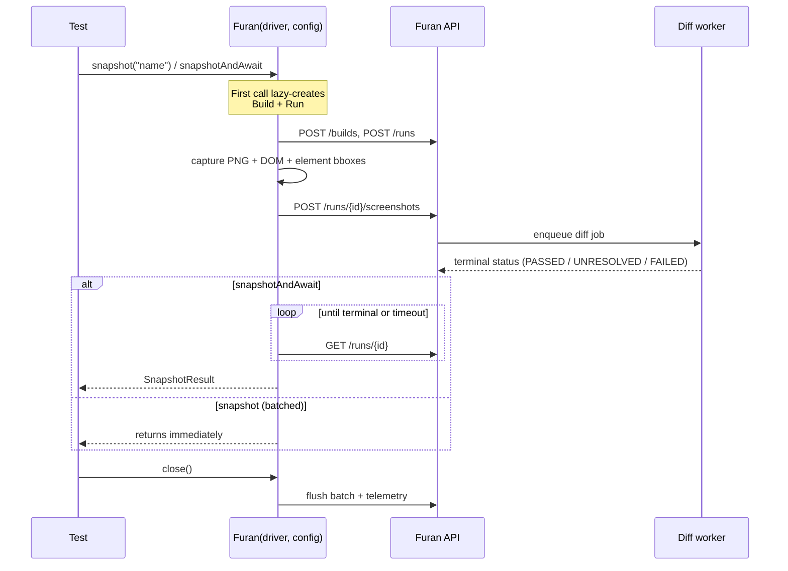
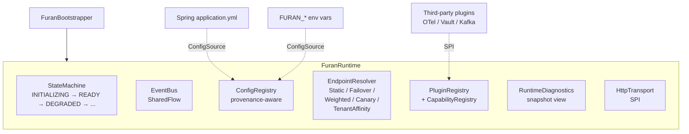

# Furan Kotlin SDK

> Visual-regression testing client for [Furan](https://github.com/qasecret/furan-monorepo) — capture screenshots in CI, diff against an approved baseline, fail the build on regressions.

[](https://central.sonatype.com/namespace/io.github.qasecret)
[](../../LICENSE)
[](https://adoptium.net/)

Drop-in for any JUnit 5 + Selenium suite. JDK 21+, Kotlin 2.x. Three artifacts, pick the one matching your use case:

| Artifact                            | When to use                                           | Depends on   |
| ----------------------------------- | ----------------------------------------------------- | ------------ |
| `io.github.qasecret:furan-selenium` | Selenium-driven tests (most common)                   | `furan-core` |
| `io.github.qasecret:furan-junit5`   | JUnit 5 `@FuranTest` annotation + parameter injection | `furan-core` |
| `io.github.qasecret:furan-core`     | Direct REST/HTTP integration without Selenium         | —            |

## Install

```kotlin
// build.gradle.kts
repositories { mavenCentral() }

dependencies {
    testImplementation("io.github.qasecret:furan-selenium:0.12.0")
    // Optional — for @FuranTest annotation:
    testImplementation("io.github.qasecret:furan-junit5:0.12.0")
}
```

Maven:

```xml
<dependency>
    <groupId>io.github.qasecret</groupId>
    <artifactId>furan-selenium</artifactId>
    <version>0.12.0</version>
    <scope>test</scope>
</dependency>
```

## Quick start

```kotlin
import io.furan.sdk.FuranConfig
import io.furan.sdk.selenium.Furan
import io.furan.sdk.dto.RunStatus
import org.junit.jupiter.api.Test
import org.openqa.selenium.chrome.ChromeDriver
import kotlin.test.assertEquals

class CheckoutTest {
    @Test
    fun `homepage renders correctly`() {
        val driver = ChromeDriver()
        Furan(driver, FuranConfig.fromEnv()).use { furan ->
            driver.get("https://app.example.com/checkout")

            // Blocks until the diff worker produces a terminal status.
            val result = furan.snapshotAndAwait("checkout-page")
            assertEquals(RunStatus.PASSED, result.status)
        }
        driver.quit()
    }
}
```

Set three environment variables before running:

```bash
export FURAN_API_URL=http://localhost:3000          # or your deployment
export FURAN_API_TOKEN=furan_pat_<from-dashboard>   # /account/tokens
export FURAN_PROJECT_ID=<from-dashboard>            # /projects/<id>
```

First run creates the baseline. Subsequent runs diff against it.

## Lifecycle



## Configuration

| Field                 | Env var                       | Default    | Notes                                                                                                             |
| --------------------- | ----------------------------- | ---------- | ----------------------------------------------------------------------------------------------------------------- |
| **`apiUrl`**          | `FURAN_API_URL`               | —          | Required. Your Furan API endpoint.                                                                                |
| **`apiToken`**        | `FURAN_API_TOKEN`             | —          | Required. `furan_pat_*` from the dashboard.                                                                       |
| **`projectId`**       | `FURAN_PROJECT_ID`            | —          | Required. UUID from the project URL.                                                                              |
| `buildId`             | `FURAN_BUILD_ID`              | —          | Groups runs into a build. Typically `$GITHUB_RUN_ID`.                                                             |
| `branchName`          | `FURAN_BRANCH`                | `"main"`   | Branch the snapshot was captured from.                                                                            |
| `parentBranchName`    | `FURAN_PARENT_BRANCH`         | —          | Parent branch; its baseline is inherited when this branch has none. Set to the PR base (`github.base_ref`) in CI. |
| `name`                | `FURAN_BUILD_NAME`            | —          | Human-readable build label (e.g. `"nightly main"`).                                                               |
| `properties`          | `FURAN_BUILD_PROPERTIES`      | empty      | Comma-separated `key=value` pairs for filtering.                                                                  |
| `softAssert`          | `FURAN_SOFT_ASSERT`           | `false`    | If `true`, `snapshotAndAwait` returns the failed result instead of throwing.                                      |
| `pollTimeoutSeconds`  | `FURAN_POLL_TIMEOUT_SECONDS`  | `60`       | How long `snapshotAndAwait` waits for the diff worker.                                                            |
| `pollIntervalSeconds` | `FURAN_POLL_INTERVAL_SECONDS` | `1`        | Polling cadence.                                                                                                  |
| `dashboardUrl`        | `FURAN_DASHBOARD_URL`         | —          | Where `SnapshotResult.diffViewerUrl` points; usually the dashboard host.                                          |
| `viewports`           | —                             | `1280×720` | Per-test override available; multi-viewport snapshots loop internally.                                            |
| `logLevel`            | `FURAN_LOG_LEVEL`             | `"info"`   | `trace` / `debug` / `info` / `none`.                                                                              |
| `caCertPath`          | `FURAN_CA_CERT_PATH`          | —          | PEM file for custom CA (corporate-proxy / self-signed TLS).                                                       |

Four ways to build a `FuranConfig`:

```kotlin
// 1. From env vars (recommended for CI):
val config = FuranConfig.fromEnv()

// 2. From a YAML file (handy for local dev and declarative test setup):
val config = FuranConfig.fromYaml(Path.of("application.yml"))

// 3. Explicit:
val config = FuranConfig(
    apiUrl = "https://furan.acme.com",
    apiToken = System.getenv("FURAN_API_TOKEN"),
    projectId = "003f5fcf-6c5f-4f1f-a99f-82a697711382",
    branchName = "feature/payments",
    softAssert = true,
)

// 4. Copy + override (data class):
val ci = FuranConfig.fromEnv().copy(
    buildId = System.getenv("GITHUB_RUN_ID"),
    name = "nightly-main",
    properties = mapOf("region" to "us-east-1"),
)
```

### YAML

`application.yml` driven config — handy for declarative test setup:

```kotlin
val config = FuranConfig.fromYaml(Path.of("application.yml"))
```

The companion `YamlConfigSource` slots into the v2 `FuranBootstrapper` chain at priority 50 (between sysprop and defaults). Env vars still override every YAML entry, so CI doesn't have to rewrite the file.

## API

### `furan.snapshot(name)` — fire-and-forget

Captures and uploads in the background. Returns immediately. Use when you have **many** snapshots in one test and only want to review failures asynchronously in the dashboard.

```kotlin
furan.snapshot("homepage")
furan.snapshot("login-page", mask = listOf("[data-test=session-id]"))
furan.snapshot("settings", viewports = listOf(Viewport(1920, 1080)))
```

### `furan.snapshotAndAwait(name)` — synchronous assert

Captures, uploads, and **blocks until the diff worker produces a terminal status**. Throws `FuranAssertionException` on `UNRESOLVED` / `FAILED` / `ABORTED` (unless `softAssert = true`). Throws `FuranTimeoutException` after `pollTimeoutSeconds`. Best for happy-path assertion-style tests.

```kotlin
val result = furan.snapshotAndAwait("checkout-page")
// On PASSED: result.status == RunStatus.PASSED
// result.diffViewerUrl points at the dashboard for review
```

### Per-test ignore regions + diff tolerance

```kotlin
import io.furan.sdk.dto.IgnoreArea

val furan = Furan(
    driver = driver,
    config = config,
    diffTolerance = 0.02,                            // 2% pixel-difference threshold
    ignoreAreas = listOf(
        IgnoreArea(x = 100, y = 50, width = 200, height = 30),  // mask the timestamp bar
    ),
)
```

Both apply on the first diff job server-side — no separate round-trip.

## JUnit 5 integration

Add `furan-junit5` and annotate your test class with `@FuranTest`. The extension auto-resolves `FuranConfig` and `FuranClient` as test-method parameters:

```kotlin
import io.furan.sdk.FuranClient
import io.furan.sdk.FuranConfig
import io.furan.sdk.junit5.FuranTest
import io.furan.sdk.selenium.Furan
import org.junit.jupiter.api.Test
import org.openqa.selenium.chrome.ChromeDriver

@FuranTest
class CheckoutTest {

    @Test
    fun `homepage`(config: FuranConfig) {
        val driver = ChromeDriver()
        Furan(driver, config).use { furan ->
            driver.get("https://app.example.com")
            furan.snapshotAndAwait("homepage")
        }
        driver.quit()
    }

    @Test
    fun `direct REST access`(client: FuranClient) {
        // Lower-level — no Selenium, drives the API directly.
        // client.createBuild(...), client.snapshotAndAwait(...)
    }
}
```

The extension caches one `FuranConfig` per test class and shares it across `@Test` methods.

## Advanced — v2 runtime architecture (opt-in)

For Spring Boot apps, plugin ecosystems, or when you want **pluggable transports / capability registries / event-bus telemetry**, the SDK ships a layered runtime under `io.furan.sdk.runtime.FuranBootstrapper`:



Bootstrap a runtime with explicit subsystems:

```kotlin
import io.furan.sdk.runtime.FuranBootstrapper
import io.furan.sdk.endpoint.EndpointResolutionConfig
import io.furan.sdk.http.KtorHttpTransport

val runtime = FuranBootstrapper(
    endpointConfig = EndpointResolutionConfig(
        primary = "https://api-us.acme.com",
        fallbacks = listOf("https://api-eu.acme.com"),
    ),
    loadPluginsFromClasspath = true,        // discover plugins via ServiceLoader
    httpTransportFactory = { KtorHttpTransport() },
).bootstrap()

// Inspect:
runtime.state                                 // RuntimeState.READY
runtime.capabilities?.has(Capability.Tracing) // true if an OTel plugin loaded
runtime.diagnostics?.snapshot()               // operator dump for actuator endpoints

// Plugins / decorators subscribe to the bus:
runtime.eventBus.subscribe<StateChangedEvent> { event ->
    log.info("state {} → {}", event.from, event.to)
}

runtime.use { /* runtime closes on exit */ }
```

The v2 runtime is **fully opt-in** — the classic `Furan(driver, config)` path doesn't go through it and won't until v1.0. The bootstrapper exists today for early adopters wiring custom plugins (OTel exporters, Vault credential providers, etc).

See [`furan-design/specs/2026-05-25-sdk-config-discovery-design-v2.md`](../../furan-design/specs/2026-05-25-sdk-config-discovery-design-v2.md) for the full architecture spec.

## Examples

| Example                                                                            | Description                                                                        |
| ---------------------------------------------------------------------------------- | ---------------------------------------------------------------------------------- |
| [`examples/sdk-selenium-junit5`](examples/sdk-selenium-junit5/)                    | Standalone Gradle project — copy-paste-runnable JUnit 5 + Selenium + ChromeDriver. |
| [`docs/integrations/github-actions.md`](../../docs/integrations/github-actions.md) | GitHub Actions workflow with PR comments + branch baselines.                       |

## Versioning

The SDK is published from `main` via [release-please](https://github.com/googleapis/release-please) on Conventional Commits. The current `version.txt` is the single source of truth — `core`, `selenium`, and `junit5` always share the same version.

| Range | Status  | Compatibility                                                                                   |
| ----- | ------- | ----------------------------------------------------------------------------------------------- |
| `0.x` | Current | API stable; new features additive, breaking changes only at minor bumps with deprecation.       |
| `1.0` | Planned | `FuranClient` will migrate to consume `FuranRuntime` internally. Both code paths coexist today. |

## Support

- **Issues:** [github.com/qasecret/furan-monorepo/issues](https://github.com/qasecret/furan-monorepo/issues)
- **Server docs:** Root [`README.md`](../../README.md) covers self-hosting + Docker Compose install.
- **API reference:** `GET /openapi.json` on your deployment, or interactive docs at `GET /docs`.

## License

Apache 2.0 — see [`LICENSE`](../../LICENSE).
